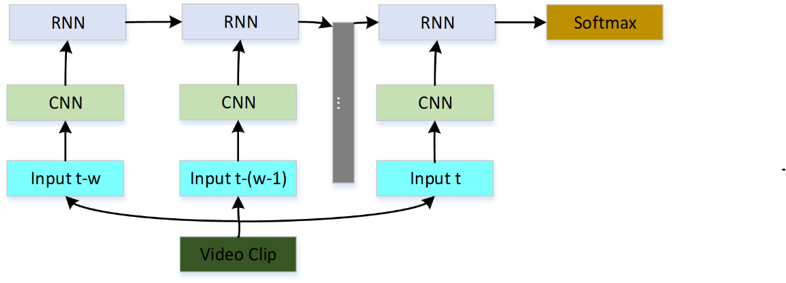

# About Codes

all the codes are writen in python.

​					Fig.1 Video Classification

## Environment

- Python3.5

- tensorflow 1.1

- ffmpeg

- librosa

  and for other python packages, you can use `pip install package-name ` whenever there comes up a `ImportError`.

## Code Guide

#### Rename the video file

rename_file.py:  because the video files' names are all in characters,  it is necessary to rename the file according to their video id.

***this should be already been done, you can just leave it alone.***

#### Extract the image frames and the audio clips from the video file

extract_frame.py: extract the image frames from the video file , also log  the errors when extracting. 

***in this step, you can just type `python extract_frame.py` for extracting images.***

#### Preprocess the data

extract_fc7.py: extract the fc_7 feature of the image frames ad save them to the hdf file.

frame_to_h5.py: load the image and save them to the hdf file

#### Classification

video_clf_lstm.py: video classification , the framework is CNN+LSTM  as Fig.1.

## TODO

- Save the data in the TFRecords format instead of the hdf file. Maybe more efficient and convenient for the tensorflow data feeding.